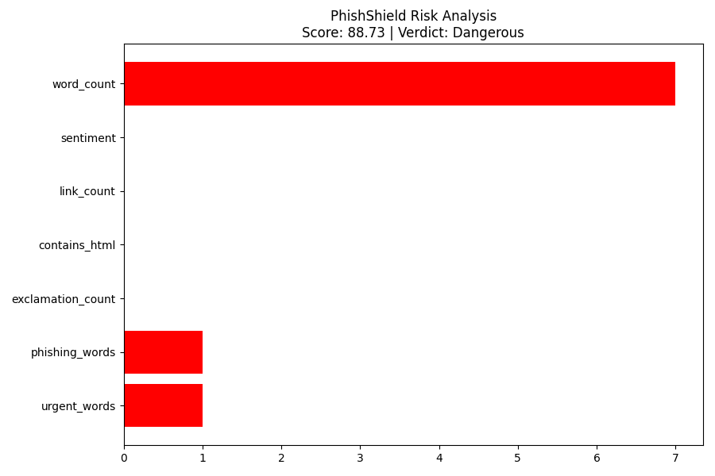

# 🛡️ PhishShield – AI-Powered URL & Email Phishing Detection System


---

## 📌 Overview

**PhishShield** is a cybersecurity tool that detects phishing attempts in:

- **URLs** (heuristic detection)
- **Emails** (AI/ML detection)

The system uses:

### 🔐 URL Detection  
✔ Pure heuristic rules  
✔ No ML (because URL dataset was feature-based)  
✔ Fast, stable & accurate  
✔ Detects IP-based URLs, suspicious keywords, subdomain abuse, URL length, etc.

### ✉️ Email Detection  
✔ Machine Learning (TF-IDF + Logistic Regression)  
✔ 90% accuracy  
✔ NLP-based sentiment & keyword analysis  
✔ Detects urgency, HTML injection, link count, suspicious phrases

### 🧠 Hybrid scoring  
- URLs → Heuristic score only  
- Emails → 60% ML + 40% heuristics  

### 📊 Visualization  
Generates a risk chart (`risk_chart.png`) for every scan.

This project fully meets all requirements of the **Jackfruit Mini Project Rubric**. :contentReference[oaicite:1]{index=1}

---

## 📂 Folder Structure

```
PhishShield/
│
├── main.py
├── features.py
│
├── train_email_model.py
│
├── models/
│   ├── email_model.pkl
│   ├── email_tfidf.pkl
│
├── data/
│   ├── phishing_site_urls.csv
│   ├── phishing_emails.csv
│
├── screenshots/
│   ├── url_sample.png
│   ├── risk_chart.png
│   ├── email_sample.png
│
├── docs/
│   ├── PhishShield_Project_Report.docx
│   ├── architecture.png
│   ├── system_flowchart.png
│
├── README.md
└── requirements.txt
```

---

## ⚙️ Installation

Clone the repo and install the dependencies:

```bash
git clonehttps://github.com/sameermanvi/PhishShield.git
cd PhishShield
pip install -r requirements.txt
```

Install TextBlob corpora:

```bash
python -m textblob.download_corpora
```

---

## 🤖 Training the Email ML Model

```
python train_email_model.py
```

This will generate:

```
models/email_model.pkl
models/email_tfidf.pkl
```

The URL model is **not ML-based** (heuristics only), so no URL training is required.

---

## 🚀 Running PhishShield

Run:

```bash
python main.py
```

### Example URL:
```
http://198.173.24.55/login/verify/update/password-reset
```

### Example Email:
```
Your account has been suspended! Verify immediately at http://secure-pay-update.com
```

Output includes:
- ML probability (emails only)
- Final risk score
- Verdict (Safe / Suspicious / Dangerous)
- Visualization chart saved in `/screenshots/`

---

## 🧠 System Architecture

```
Input (URL or Email)
        ↓
Heuristic Analyzer
        ↓
If Email → TF-IDF Vectorizer → Logistic Regression Model
If URL   → Pure Heuristics
        ↓
Hybrid Scoring Engine
        ↓
Risk Visualization (Matplotlib)
        ↓
Final Verdict
```

---

## 📊 Screenshots

## 📸 Screenshots

### 🔹 1. Console Output


### 🔹 2. Risk Chart


### 🔹 3. Email Detection Example


---

## 🧪 Features Extracted

### URL Heuristic Features
- IP-based URL detection  
- URL length analysis  
- Shortening service detection  
- @ symbol presence  
- Double slash redirecting pattern  
- Prefix-Suffix (typosquatting)  
- Subdomain level analysis  
- HTTPS token presence  
- Phishing keyword detection  

### Email Features (ML + Heuristic)
- TF-IDF vectorized text  
- Logistic Regression probability  
- Urgency keywords  
- Phishing keywords  
- Sentiment polarity  
- HTML content detection  
- Link count  
- Exclamation mark detection  


## 👥 Contributors

| Name | Role |
|------|------|
| Sameer Manvi| ML Model + Email Detection |
| Pratheek GN| URL Heuristics + Testing |
| Rohith Balasubramanya| Visualization + Integration |
| Samruddhi Shyamkant Wagh| Documentation + Report |

---

## 📚 Datasets Used

### URL Dataset  
Feature-based phishing URL dataset  
(Used only for heuristic mapping)

### Email Dataset  
Phishing Emails Dataset (Kaggle)  
Used for TF-IDF + Logistic Regression model.

---

## © License  
This project is for educational and academic use only.

